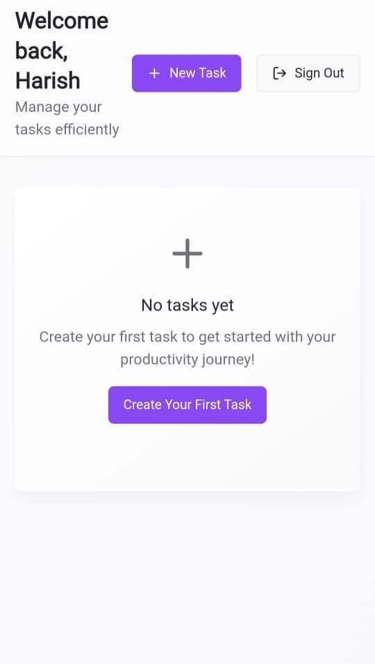
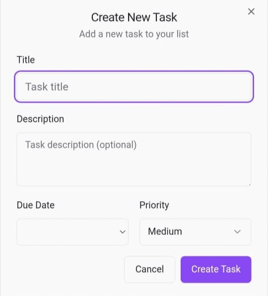
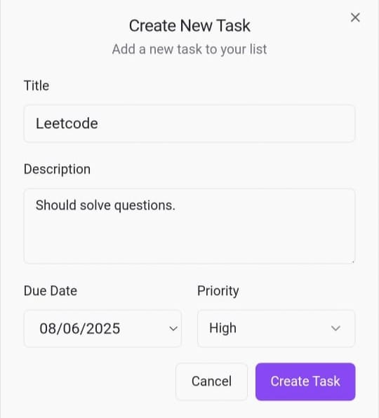

# 📝 ToDo Application

A simple and effective **To-Do List Application** designed to help you manage and track your daily tasks with ease. Built using modern web technologies, this app provides an intuitive interface for task creation, editing, and deletion, with persistent storage powered by Supabase.

---

## 🚀 Problem Statement

The goal of this project is to develop a user-friendly to-do list application that allows you to:

- Add new tasks
- Mark tasks as completed
- Edit and delete tasks
- Store tasks persistently using Supabase for backend functionality

Stay organized and keep track of your daily tasks efficiently!

---

## 🔧 Technology Stack

| **Layer**            | **Technology Used**              |
|----------------------|----------------------------------|
| **Frontend**         | TypeScript, React Native, Tailwind CSS  |
| **Backend**          | Supabase                         |
| **Authentication**   | Supabase Auth                    |

---

## 📁 Project Structure

```
ToDoApp/
├── OutputPreview          # Images of the OutputPreview
├── public/                # Static files
├── src/                   # Main source code for React app
│   ├── components/        # React components for tasks, modals, etc.
│   ├── App.tsx            # Main app component
│   ├── index.tsx          # Entry point of the React app
│   └── styles/            # Tailwind CSS files and custom styling
├── supabase/              # Supabase client and integration files
├── .gitignore             # Git ignore file
├── tailwind.config.ts     # Tailwind CSS configuration
├── postcss.config.js      # PostCSS configuration
├── vite.config.ts         # Vite configuration for build and dev server
├── package.json           # Dependencies and scripts
└── README.md              # Documentation
```
### Architecture Diagram

```plaintext
              +-------------------+
              |    User Device    |
              | (Web/Mobile App)  |
              +-------------------+
                        |
                        V
      +--------------------------------------------+
      |            Frontend (React Native)         |
      |  - Task List UI                            |
      |  - Task Creation/Edit/Delete Modals        |
      |  - Authentication Screens                  |
      |  - Tailwind CSS for Styling                |
      +--------------------------------------------+
                        |
                        V
+---------------------------------------------------------------+
|                  Supabase Backend (Cloud)                     |
|                                                               |
|  +-------------------+    +-------------------------------+   |
|  | Authentication    |    |  Database (Postgres)          |   |
|  | (Supabase Auth)   |    |  - tasks table                |   |
|  | - Sign Up/Login   |    |  - user_id FK                 |   |
|  +-------------------+    +-------------------------------+   |
|           |                              |                   |
|           |                              |                   |
|           +-------------------+----------+                   |
|                               |                              |
|                   +--------------------------+               |
|                   | Supabase Client (API)    |               |
|                   |  - CRUD operations       |               |
|                   |  - Auth session mgmt     |               |
|                   +--------------------------+               |
+---------------------------------------------------------------+
                        |
                        V
               Persistent Storage for Tasks
               (User-specific, secure)

```


---

## 🛠 Features

- **Task Management**: Create, read, update, and delete tasks.
- **User Authentication**: Sign up and log in securely using Supabase Auth.
- **Responsive Design**: Works seamlessly on desktop and mobile devices.
- **Persistent Storage**: Tasks are saved in Supabase for session persistence.

---

## 🤖 Functionality

### Task Operations

- **Create Task**: Add tasks by providing a title and description.
- **Edit Task**: Update existing tasks' details.
- **Delete Task**: Remove tasks when no longer needed.
- **Complete Task**: Mark tasks as completed with a simple toggle.

### Authentication

- Register and log in using Supabase Auth for secure authentication.
- Manage only your own tasks after logging in.

### Responsive Design

- Automatically adapts to different screen sizes for a seamless experience.

---

## 📝 How to Run the Project

### 1. Clone the Repository

```bash
git clone https://github.com/Harish8703/todo.git
cd todo
```

### 2. Install Dependencies

```bash
npm install
```

### 3. Run the Application

```bash
npm run dev
```

Open your browser and visit [http://localhost:3000](http://localhost:3000) to view the To-Do app in action!

---

## 📸 Output Preview

### Home Page - Task List


### Task Creation Modal


### Task Editing Screen


### Task Completed View


---

## 🔮 Future Work

- Implement task categorization with color-coding.
- Add a task reminder feature using notifications.
- Enhance security with email verification and password recovery features.
- Integrate real-time updates using Supabase subscriptions.

---

## 🏁 Conclusion

This To-Do Application provides a simple, effective way for users to manage their daily tasks using modern technologies like React, TypeScript, Tailwind CSS, and Supabase. It demonstrates a full-stack application with both frontend and backend integration, and is ready for further enhancements!

---

Made with ❤️ by [Harish8703](https://github.com/Harish8703)
